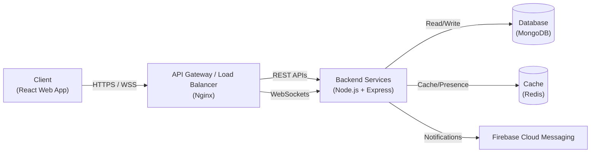
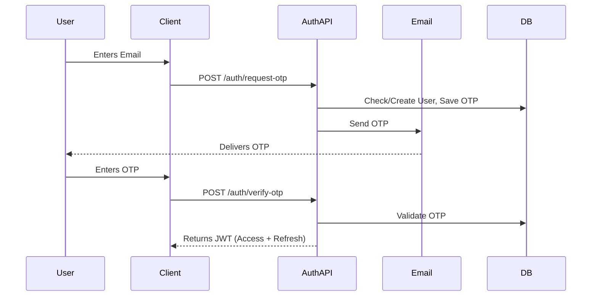
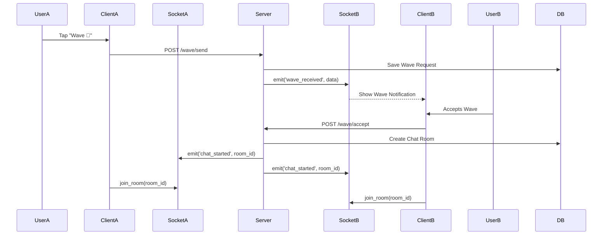
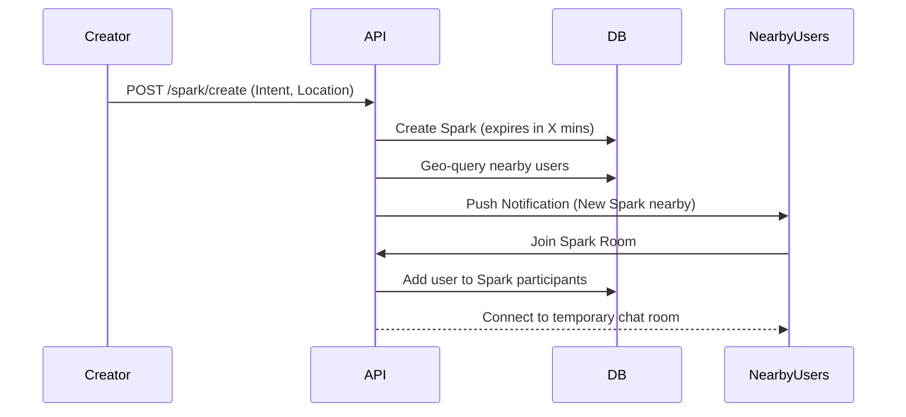
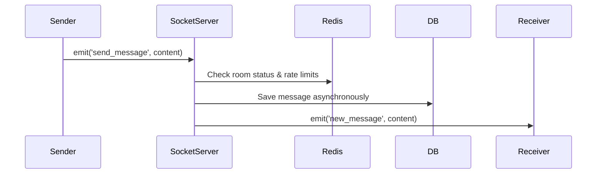

# High-Level Technical Architecture

## 1. System Overview

**Echo** is designed as a real-time, location-aware web application. For the V1 Minimum Viable Product (MVP), the system adopts a monolithic architecture to accelerate development and simplify deployment. As the user base grows and features like Interest Bubbles and AI Moderation are introduced in V2/V3, the architecture is designed to gracefully transition into a microservices-oriented model.



## 2. Tech Stack

- **Frontend**: React + TypeScript (Vite for build tooling)
- **Backend**: Node.js + Express.js
- **Database**: MongoDB (Mongoose ODM)
- **Real-time**: Socket.IO
- **Cache/Presence**: Redis
- **Auth**: Email OTP (Nodemailer / Resend) + JWT (Access + Refresh Tokens)
- **Push Notifications**: Firebase Cloud Messaging (FCM)
- **Location**: Browser Geolocation API + server-side geospatial queries (MongoDB 2dsphere indexes)
- **Deployment**: Docker containerization, Nginx as a reverse proxy

## 3. Architecture Diagram

```mermaid
flowchart TD
    subgraph Client [Client Side]
        ReactApp["React App (TypeScript)"]
        SocketClient["Socket.IO Client"]
        GeoAPI["Geolocation API"]
        
        ReactApp --- SocketClient
        ReactApp --- GeoAPI
    end

    subgraph Server [Server Side - Node.js + Express]
        API["REST API\n(Express)"]
        SocketServer["Socket.IO Server"]
        AuthMid["Auth Middleware\n(JWT validation)"]
        GeoEngine["Geospatial Engine"]
        
        API --> AuthMid
        SocketServer --> AuthMid
    end

    subgraph Data [Data Layer]
        Mongo[(MongoDB)]
        Redis[(Redis)]
        
        subgraph MongoDB Collections
            Users
            Chats
            Sparks
            Messages
        end
        Mongo -.-> MongoDB Collections
        
        subgraph Redis Data
            Sessions
            Presence["Online Presence"]
            RateLimit["Rate Limiting"]
            Trust["Trust Scores (Temp)"]
        end
        Redis -.-> Redis Data
    end

    subgraph External [External Services]
        FCM["Firebase Cloud\nMessaging"]
        Email["Email Service\n(OTP)"]
    end

    ReactApp -- "HTTPS (REST)" --> API
    SocketClient -- "WSS" --> SocketServer
    
    API <--> Mongo
    API <--> Redis
    SocketServer <--> Redis
    SocketServer <--> Mongo
    
    API --> Email
    API --> FCM
    SocketServer --> FCM
    
    GeoEngine <--> Mongo
    API <--> GeoEngine
```

## 4. Backend Architecture

The backend follows a modular, feature-based directory structure to keep concerns separated and make future extraction into microservices easier.

```text
src/
├── config/             # Environment variables, DB connections
├── middleware/         # auth, rateLimit, errorHandler, request logger
├── modules/            # Feature modules
│   ├── auth/           # controller, service, routes, validators
│   ├── user/           # User profile, privacy settings
│   ├── discovery/      # Geospatial queries, location updates
│   ├── wave/           # Wave requests, accept/reject logic
│   ├── chat/           # REST endpoints for chat history, save logic
│   ├── spark/          # Spark creation, join, mini-rooms
│   ├── compliment/     # Secret compliments
│   ├── moderation/     # Report, block, mute
│   └── trust/          # Trust score calculation
├── socket/             # Socket.IO handlers, connection middleware
├── utils/              # Helper functions (EchoID generator, geo-math)
└── app.js              # Express app initialization
```

## 5. Frontend Architecture

- **Structure**: Feature-based folder structure (e.g., `src/features/chat`, `src/features/discovery`).
- **State Management**: Zustand for global state (user profile, auth state, active chat context) to ensure minimal boilerplate.
- **Real-time**: Socket.IO client integrated via custom React hooks (`useSocket`).
- **Location**: Custom hook (`useGeolocation`) to periodically fetch and report location.
- **Routing**: React Router managing the 3 main tabs: `Nearby`, `Sparks`, `Saved`.

## 6. Data Flow Diagrams

### Auth Flow



### Wave → Chat Flow



### Spark Creation Flow



### Real-time Message Flow



## 7. Security Architecture

- **Authentication**: JWT strategy. Access tokens for short-lived access (e.g., 15 mins), Refresh tokens stored securely in HTTP-only cookies for session renewal.
- **Rate Limiting**: Implemented via Redis to prevent API abuse (e.g., limiting OTP requests, message frequency).
- **Input Sanitization**: Strict validation using libraries like Zod or Joi on incoming requests to prevent XSS and injection attacks. Since chat is text + emojis only, stripping HTML is straightforward.
- **Location Privacy**: **Exact GPS coordinates are NEVER exposed to the client.** The backend resolves coordinates into distance buckets (50m, 100m, 250m) and context labels before sending data to the client.
- **Anonymity**: EchoID is cryptographically random. Identity is verified strictly against the combination of Username + EchoID.
- **Trust Score System**: A hidden backend metric updated based on user behavior (reports received, messages ignored, positive interactions). It regulates permissions like how many Sparks a user can create or how visible they are.

## 8. Scalability Considerations

- **Database**: MongoDB allows geospatial indexing (`2dsphere`) which handles millions of location queries efficiently. As the app scales, collections can be sharded based on geographical regions.
- **Real-time Communication**: Socket.IO servers can be scaled horizontally using the Redis Adapter, allowing clients connected to different server instances to exchange messages.
- **Connection Pooling**: Implemented on the database layer to manage high concurrent connections efficiently.
- **Asset Delivery**: Static assets and the React frontend will be served via a CDN (e.g., Cloudflare or AWS CloudFront) to reduce latency globally.
