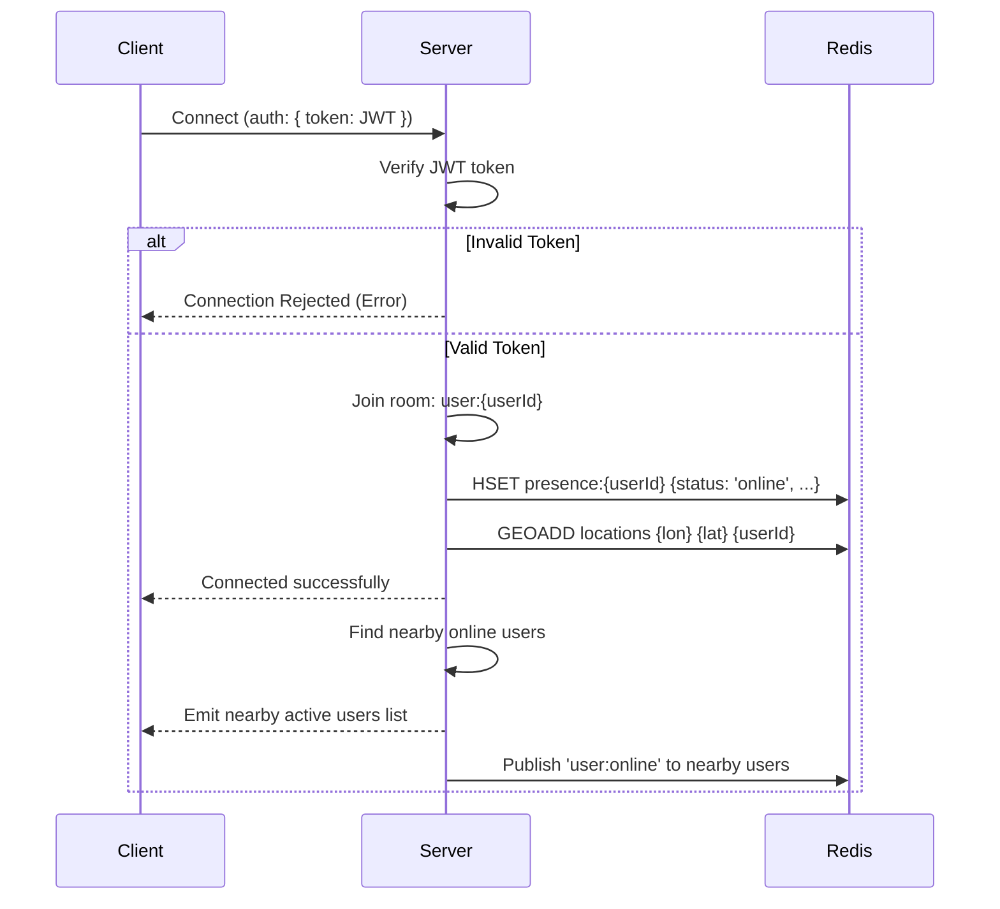
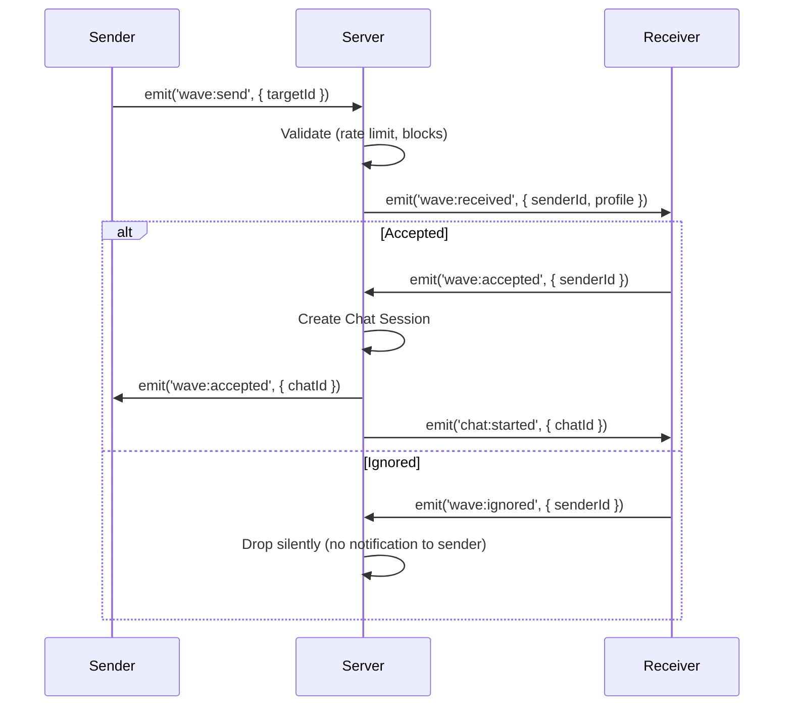
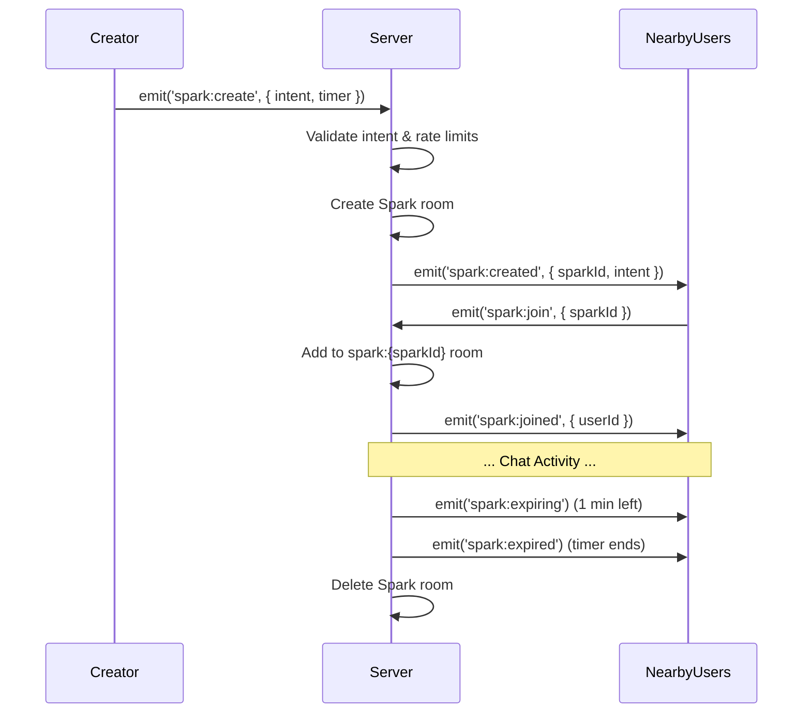

# Real-time System & Socket Events

This document details the real-time layer of the **Echo** platform, powered by Socket.IO and Redis. It covers the architecture, connection flow, categorized socket events, presence system, and performance considerations.

## 1. Socket.IO Architecture

The real-time layer relies on Socket.IO for bidirectional communication, backed by Redis for presence, caching, and horizontal scalability.

*   **Connection Management:** Clients connect using WebSocket with polling fallback. Connections are long-lived and managed by Socket.IO's internal heartbeat mechanism.
*   **Authentication:** JWT verification occurs during the connection handshake. Invalid tokens result in connection rejection.
*   **Namespace Strategy:** A single default namespace (`/`) is used to minimize overhead. Future features like live events might use separate namespaces.
*   **Room Strategy:**
    *   **User Rooms:** Each user joins a private room named `user:{userId}` upon connection to receive direct notifications, waves, and requests.
    *   **Conversation Rooms:** One-to-one chats use rooms named `chat:{chatId}`. Both participants join this room.
    *   **Spark Rooms:** Temporary intent-based mini rooms use `spark:{sparkId}`.
*   **Redis Adapter:** `@socket.io/redis-adapter` is used to synchronize events across multiple Node.js instances (horizontal scaling), utilizing Redis Pub/Sub.

## 2. Connection Flow

When a client attempts to connect, the server authenticates the request and initializes the user's session.

## 3. Socket Events

Events are structured using a `domain:action` naming convention.

### Presence Events
*   `user:online`: Broadcasted to nearby users when a user connects.
*   `user:offline`: Broadcasted when a user disconnects or closes the app.
*   `user:away`: Emitted when the app goes into the background.
*   `user:mood-update`: Emitted when a user changes their mood (e.g., Chill, Coding).
*   `user:location-update`: Emitted when a user moves significantly, updating context labels.

### Wave Events
*   `wave:send`: Client sends a wave request to a target user.
*   `wave:received`: Target user receives the wave notification.
*   `wave:accepted`: Target user accepts the wave; conversation is initialized.
*   `wave:ignored`: Target user ignores the wave (silent on the sender's end).

### Chat Events
*   `chat:message`: Send/receive a text or emoji message.
*   `chat:typing`: Indicates a user is typing.
*   `chat:stop-typing`: Indicates a user stopped typing.
*   `chat:read`: Message read receipt notification.
*   `chat:sleeping`: Conversation moved to a sleeping state after 10 minutes of inactivity.
*   `chat:continue`: Request to wake up a sleeping conversation.
*   `chat:save-request`: User A requests to save the chat permanently.
*   `chat:save-response`: User B accepts/declines the save request.
*   `chat:ended`: Conversation ended by either party or due to timeout.

### Spark Events
*   `spark:created`: A new Spark was created nearby.
*   `spark:joined`: User joined a Spark room.
*   `spark:left`: User left a Spark room.
*   `spark:message`: Message sent within a Spark room.
*   `spark:expiring`: 1-minute warning before a Spark expires.
*   `spark:expired`: Spark timer ended, room deleted, and users disconnected.

### Compliment Events
*   `compliment:received`: User receives their daily secret compliment.

### System Events
*   `system:error`: Critical or generic errors (e.g., rate limit exceeded, invalid payload).
*   `system:notification`: Important app announcements or warnings.

## 4. Presence System (Redis)

Redis is heavily utilized for fast, ephemeral state management.

*   **User Presence Hash:** `presence:{userId}`
    *   Fields: `status` ('online', 'away', 'offline'), `lastSeen` (timestamp), `socketId`, `mood`.
*   **Geospatial Index:** `locations`
    *   Redis GEO commands (`GEOADD`, `GEORADIUS`, `GEOSEARCH`) are used to store and query user coordinates efficiently without exposing exact GPS coordinates to clients (returns distances/hashes).
*   **Nearby Active Set:** `nearby:{geoHash}`
    *   Sorted Set where the score is the timestamp, allowing fast retrieval of active users in a specific rough area.
*   **TTL & Cleanup:** Keys have TTLs. Disconnects trigger cleanup tasks. Orphaned keys are cleaned up by a periodic background worker to ensure accuracy.

## 5. Typing Indicators

To prevent socket flooding:
*   Typing events (`chat:typing`) are debounced on the client-side.
*   The server propagates typing events with a cooldown.
*   Auto-clear: The client automatically clears the typing indicator after 3 seconds of no activity, or upon receiving a `chat:stop-typing` or `chat:message` event.

## 6. Rate Limiting

To protect the server and maintain a good user experience:
*   **Socket Event Limit:** Global limit on messages per socket connection (e.g., 50 events/sec).
*   **Wave Limit:** Limit waves to prevent spam (e.g., max 5 pending waves, 1 wave per user per day).
*   **Message Limit:** Standard messaging rate limit (e.g., 20 msgs/10 sec) to prevent flooding.

## 7. Reconnection Strategy

Mobile networks are unstable, so robust reconnection handling is essential.
*   **Auto-reconnect:** Client uses exponential backoff to attempt reconnections.
*   **Message Queue:** Outbound messages created while offline are queued locally and sent upon reconnection.
*   **State Reconciliation:** On reconnect, the client requests a fast sync (last 50 messages, missed notifications) to catch up on missed events.

## 8. Performance Considerations

*   **Payload Size:** Keep JSON payloads minimal. Avoid sending full user profiles in every message; rely on IDs and client-side caching.
*   **Connection Pooling:** Optimize Node.js and Redis connection pools to handle high concurrency.
*   **Multi-Server Support:** The architecture assumes multiple Node.js instances. Socket.IO Redis Adapter handles pub/sub to route messages to the correct server holding the target socket connection.
*   **Geospatial Performance:** Redis GEO queries are extremely fast, but querying large radiuses (e.g., >5km) should be restricted or paginated. Echo relies on small radiuses (50m-500m), making it highly performant.
