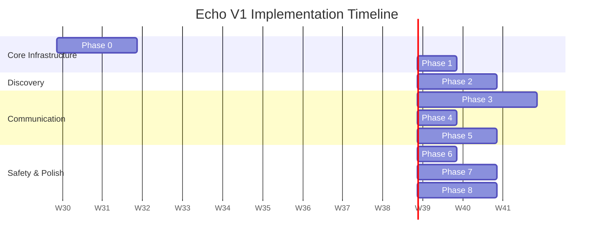

# Echo: Phase-wise Implementation Roadmap

**Echo** – Talk beyond hesitation.
*A campus/nearby interaction platform that breaks social barriers.*

---

## Roadmap Overview

This document outlines the implementation phases for the Echo MVP (V1) and future visions (V2 & V3).

## Timeline Summary

| Phase | Description | Duration |
| --- | --- | --- |
| **Phase 0** | Foundation | Week 1-2 |
| **Phase 1** | Authentication & Identity | Week 2-3 |
| **Phase 2** | Discovery & Presence | Week 3-5 |
| **Phase 3** | Wave & Chat | Week 5-8 |
| **Phase 4** | Conversation Lifecycle | Week 8-9 |
| **Phase 5** | Sparks | Week 9-11 |
| **Phase 6** | Trust & Safety | Week 11-12 |
| **Phase 7** | Polish & Extras | Week 12-14 |
| **Phase 8** | Launch Prep | Week 14-16 |

## Gantt Chart

---

## Phase Details (MVP - V1)

### Phase 0: Foundation (Week 1-2)
- **Estimated Duration:** 2 Weeks
- **Key Deliverables:** 
  - Project setup (Vite + React + TypeScript)
  - Backend setup (Node.js + Express + MongoDB + Redis)
  - Development environment configuration
  - CI/CD pipeline setup (basic)
  - Documentation finalization
- **Dependencies:** None
- **Success Criteria / Milestones:** 
  - "Hello World" app successfully deployed via CI/CD.
  - Local dev environment documented and reproducible.
- **Risk Factors:** Unforeseen environment issues could delay initial setup.

### Phase 1: Authentication & Identity (Week 2-3)
- **Estimated Duration:** 1 Week
- **Key Deliverables:**
  - Email OTP system
  - JWT authentication (access + refresh tokens)
  - Username + EchoID generation (3-20 chars, A-Z, 0-9, _, . + 6-char backend ID)
  - User profile (basic)
  - Auth middleware
- **Dependencies:** Phase 0
- **Success Criteria / Milestones:**
  - User can sign up/log in using email OTP.
  - EchoID uniquely assigned and tokens securely managed.
- **Risk Factors:** Email deliverability for OTPs (might need a reliable provider).

### Phase 2: Discovery & Presence (Week 3-5)
- **Estimated Duration:** 2 Weeks
- **Key Deliverables:**
  - Geolocation integration (browser API)
  - MongoDB geospatial queries (2dsphere)
  - Nearby user discovery (distance rounded to 50m, 100m, 150m, 250m, 500m)
  - Context-aware location labels (e.g., Library, Cafeteria)
  - Mood system (Chill, Studying, Coffee Break, Coding, Bored, Gaming, Free)
  - Echo Presence (online/away/offline) via Redis
  - Presence UI in nearby list
- **Dependencies:** Phase 1
- **Success Criteria / Milestones:**
  - Users can see other users nearby with accurate (but privacy-preserved) distances and mood statuses.
- **Risk Factors:** Inconsistent GPS accuracy on certain devices; Redis setup complexity.

### Phase 3: Wave & Chat (Week 5-8)
- **Estimated Duration:** 3 Weeks
- **Key Deliverables:**
  - Socket.IO integration for real-time features
  - Wave 👋 request system & notification UI
  - Ice Breaker system (static database + UI)
  - Real-time 1-on-1 chat (text + emojis only)
  - Typing indicators
  - Message history
  - Conversation timer (infinite → 10 min inactivity → sleeping → continue?)
  - Chat UI (bubbles, emoji picker)
- **Dependencies:** Phase 1, Phase 2
- **Success Criteria / Milestones:**
  - Seamless, low-latency messaging.
  - Successful sending and accepting/ignoring of Waves.
- **Risk Factors:** WebSocket scaling and connection stability.

### Phase 4: Conversation Lifecycle (Week 8-9)
- **Estimated Duration:** 1 Week
- **Key Deliverables:**
  - Conversation Save flow (mutual agreement required)
  - Saved conversations tab
  - Auto-archive (24h inactivity)
  - Auto-delete (30 days)
  - Chat lifecycle management (cron jobs / TTL)
- **Dependencies:** Phase 3
- **Success Criteria / Milestones:**
  - Chats successfully transition states (active -> sleep -> saved/deleted).
  - Background jobs run without performance hits.
- **Risk Factors:** Cron job reliability and database locking on mass deletions.

### Phase 5: Sparks (Week 9-11)
- **Estimated Duration:** 2 Weeks
- **Key Deliverables:**
  - Spark creation UI
  - Spark discovery (nearby active sparks)
  - Spark rooms (group chat, max 20 members)
  - Timer system (10/20/30 min / 1 hour)
  - Auto-expiry and spark room UI
- **Dependencies:** Phase 2, Phase 3
- **Success Criteria / Milestones:**
  - Users can create, join, and chat in Sparks.
  - Sparks correctly expire and self-destruct after the set timer.
- **Risk Factors:** Managing group chat states and handling expired rooms gracefully on the UI.

### Phase 6: Trust & Safety (Week 11-12)
- **Estimated Duration:** 1 Week
- **Key Deliverables:**
  - Hidden Trust Score implementation (backend)
  - Report system
  - Block/Mute system
  - Bad words filter
  - Rate limiting
  - Content moderation (basic)
- **Dependencies:** Phase 3, Phase 5
- **Success Criteria / Milestones:**
  - Users can successfully block/report bad actors.
  - Rate limit prevents spamming.
- **Risk Factors:** Tuning trust score logic correctly without false positives.

### Phase 7: Polish & Extras (Week 12-14)
- **Estimated Duration:** 2 Weeks
- **Key Deliverables:**
  - Secret Compliment feature (1/day, template-based, anonymous, positive only)
  - UI polish and animations
  - Performance optimization
  - Error handling, Loading states, Empty states
  - Push notifications (FCM)
  - Testing (unit + integration)
- **Dependencies:** All previous phases.
- **Success Criteria / Milestones:**
  - Smooth user experience with 60fps animations.
  - Push notifications reliably delivered.
- **Risk Factors:** FCM setup on iOS (requires Apple Developer Account overhead).

### Phase 8: Launch Prep (Week 14-16)
- **Estimated Duration:** 2 Weeks
- **Key Deliverables:**
  - Security audit
  - Performance testing
  - Bug fixes
  - Documentation update
  - Deployment setup
  - Beta testing
  - Launch!
- **Dependencies:** Phase 7
- **Success Criteria / Milestones:**
  - Successful beta test with no critical bugs.
  - Production environment fully configured and scalable.
- **Risk Factors:** Unexpected load spikes at launch.

---

## Feature Prioritization Matrix (V1 MVP)

| Impact \ Effort | Low Effort | High Effort |
| --- | --- | --- |
| **High Impact** | Username/EchoID setup Nearby discovery (Geospatial) Wave requests | Real-time chat (Sockets) Sparks (Group chat + Timers) Email OTP Auth |
| **Low Impact** | Mood statuses Context labels (Library, etc.) Secret Compliment | Push Notifications (FCM) Advanced UI Animations Trust Score algorithm |

---

## Future Roadmaps

### V2 Roadmap (Post-Launch)
- **Interest Bubbles:** Connect users based on shared tags.
- **Bluetooth/WiFi Proximity:** Enhance location discovery indoors.
- **AI Conversation Starter:** Generate contextual ice breakers.
- **Collaboration Board:** A local, ephemeral pinboard.
- **Campus Radar:** High-level metrics of nearby activities (e.g., "5 Coders nearby").
- **Advanced Analytics:** Deep dive into user engagement.

### V3 Roadmap
- **Blind Match:** 3 anonymous conversations per day with unknown nearby users.
- **Live Events / Auto Rooms:** Contextual rooms created automatically around campus events.
- **AI Moderation:** Proactive toxicity detection in chat.
- **Screenshot Detection:** Alerts or bans for capturing ephemeral chats.
- **Mobile App:** Full React Native application for iOS and Android.
