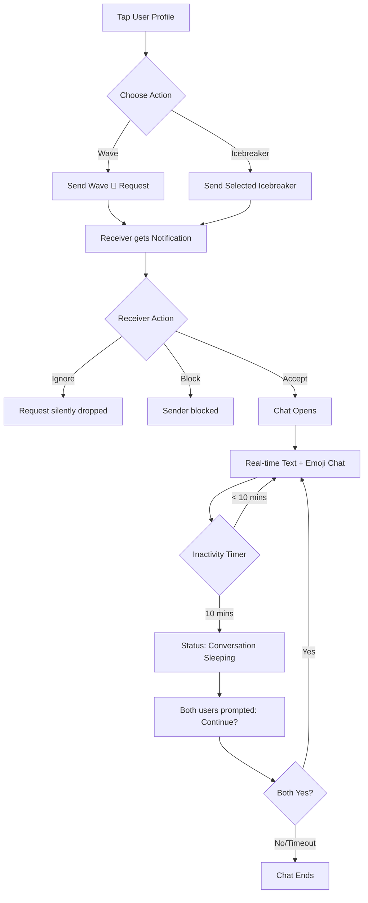
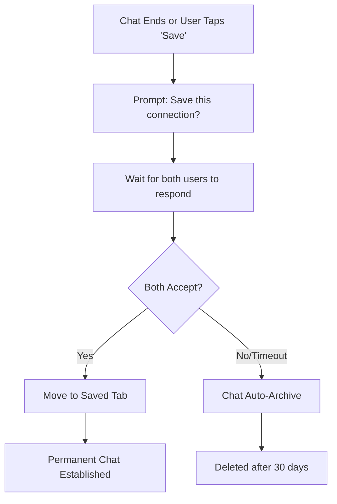
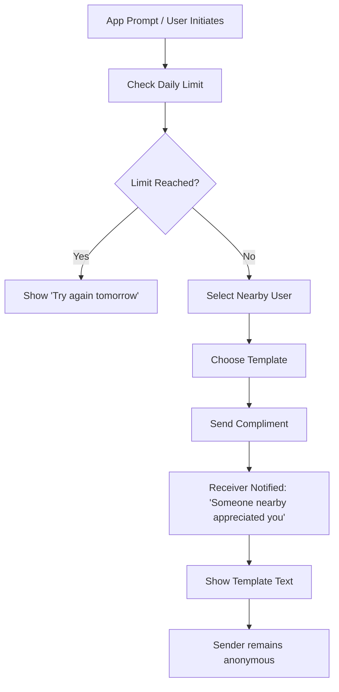
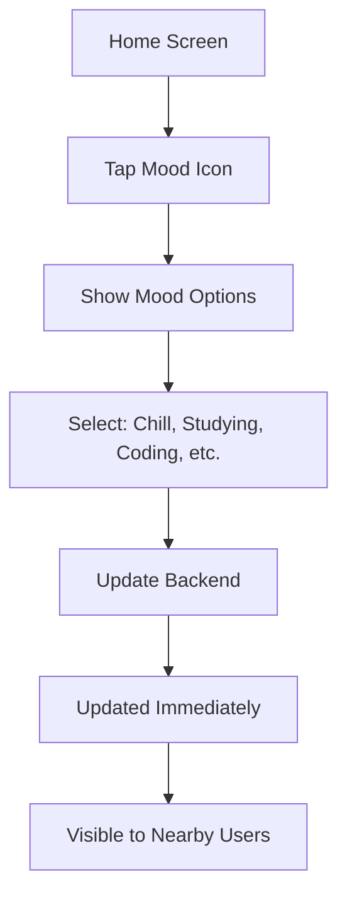
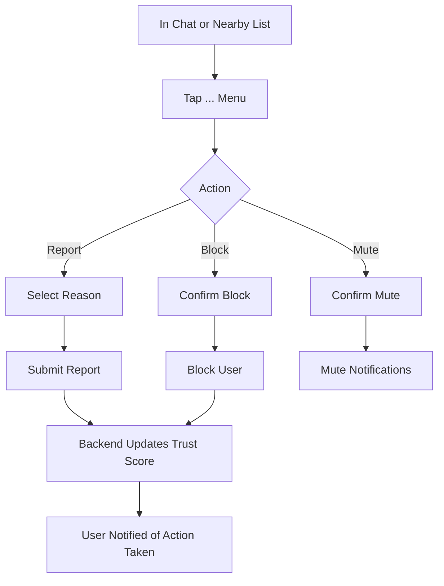
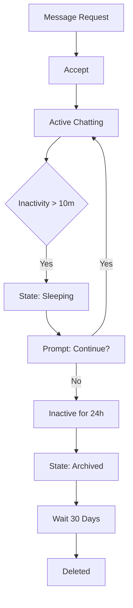
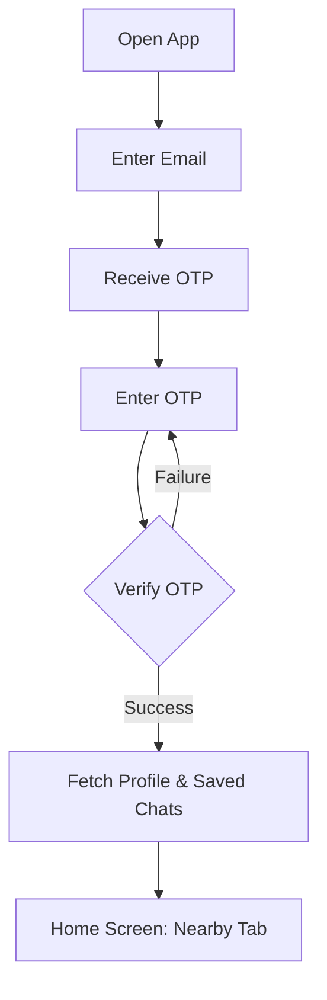

# Echo: User Flows

This document details the primary user journeys and interactions within the Echo platform. Each section outlines a specific flow from the user's perspective, supported by a Mermaid flowchart for implementation guidance.

## 1. Onboarding Flow
The process a new user goes through to create their anonymous identity and enter the app.

```mermaid
flowchart TD
    A[Open App] --> B[Enter Email]
    B --> C[Receive OTP via Email]
    C --> D[Enter OTP]
    D --> E{Verify OTP}
    E -- Success --> F[Choose Username (3-20 chars)]
    E -- Failure --> D
    F --> G[Backend Generates EchoID]
    G --> H[Prompt Location Permission]
    H --> I{Permission Granted?}
    I -- Yes --> J[Optional: Set Mood]
    I -- No --> H1[Explain why location is needed] --> H
    J --> K[Home Screen: Nearby Tab]
```

## 2. Nearby Discovery Flow
How users discover and view people around them.

```mermaid
flowchart TD
    A[Home Screen: Nearby Tab] --> B[Fetch Nearby Users (Location API)]
    B --> C[Display List of Anonymous Users]
    C --> D{User Details Shown}
    D --> D1[Username]
    D --> D2[Distance: 50m/100m/etc.]
    D --> D3[Mood Emoji]
    D --> D4[Presence: Active Now/Away]
    D --> D5[Context Label: Library/Cafe/etc.]
    C --> E[Tap on a User]
    E --> F[Show Options]
    F --> G1[Wave 👋]
    F --> G2[Start with Icebreaker]
```

## 3. Wave & Chat Flow
Initiating contact and the lifecycle of a real-time conversation.



## 4. Conversation Save Flow
Transitioning a temporary chat into a saved connection.



## 5. Sparks Flow
Creating and joining temporary, intent-based local group chats.

```mermaid
flowchart TD
    A[Navigate to Sparks Tab] --> B{Action}
    B -- View Sparks --> C[See nearby Sparks within ~200m]
    C --> D[Tap to Join Spark Room]
    D --> E[Enter Group Chat]
    B -- Create Spark --> F[Enter Intent Text (e.g., Anyone for chai?)]
    F --> G[Set Timer: 10/20/30m, 1h]
    G --> H[Publish Spark]
    H --> I[Visible to Nearby Users]
    I --> J[Users join & chat]
    E --> K{Timer Counts Down}
    J --> K
    K -- Timer Ends --> L[Room Auto-Deleted]
```

## 6. Secret Compliment Flow
Sending anonymous positive feedback (max 1/day).



## 7. Mood Update Flow
Updating current status/intent.



## 8. Report/Block Flow
Moderation and trust management.



## 9. Chat Lifecycle
The complete journey of a chat thread.



## 10. Login (Returning User)
Accessing an existing account.


